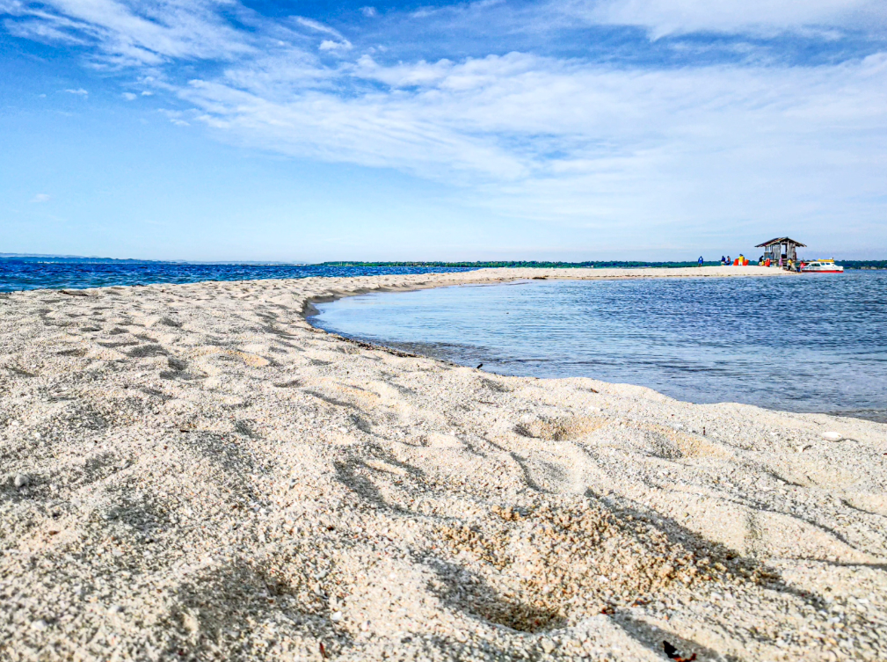

# 🌴 Panacalan Island Sandbar Travel Blog 🌊

**Welcome to the My website for Panacalan Island Sandbar**, a breathtaking destination located in the heart of Pangasinan, Philippines. This webpage serves as a complete guide for exploring the natural beauty of Panacalan Island, offering visitors essential travel tips, must-do activities, and insights on sustainable tourism. Whether you're a first-time visitor or a seasoned traveler, our website provides everything you need to make your journey unforgettable.

We aim to inspire adventure while promoting environmentally friendly travel practices, ensuring that Panacalan Island remains a pristine haven for generations to come.

---

## 🌟 Key Features

- **🌐 Responsive Design**: Optimized for seamless experiences on both mobile and desktop devices.
  
- **📖 Guided Sections**: Dedicated pages cover travel tips, top activities, and a vibrant gallery to showcase Panacalan’s unique charm.

- **🎨 User Experience**: Easy navigation, engaging visuals, and practical information tailored for new and returning visitors.

- **🌱 Sustainable Tourism**: Highlights the importance of responsible travel, with respect for local ecosystems and communities.

---

## 📸 Screenshots




  
---

## 🚀 Getting Started

### Cloning the Repository
To get a local copy of this project, clone the repository with:
```bash
git clone https://github.com/Joveboy-IT/MyFirstRepo.git
